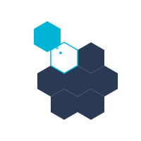

<div align="center">



# NullShift

### AI-Powered SOC Triage Assistant

*Turn a queue of raw detections into a queue of pre-investigated cases.*

[](LICENSE)
[](https://www.python.org/)
[](#author)

</div>

---

## What is NullShift?

**NullShift** is an open-source AI assistant for L1 SOC analysts. It plugs into your SIEM, retrieves the right playbook for the alert at hand, runs the deterministic investigation steps, enriches IOCs against threat intelligence, and produces a structured report — so analysts spend their time on the 5% of detections that matter, not the 95% that look suspicious but aren't.

It works with any major LLM provider — Anthropic Claude, OpenAI GPT, or a fully local Ollama model — and connects to **LimaCharlie**, **Wazuh**, **Splunk**, **Elastic**, or **Microsoft Sentinel** out of the box.

## Highlights

- 🧠 **12 LLM providers** — Claude Agent SDK (use your Claude subscription, no API key), cloud APIs, or fully local Ollama (even hosted on another machine over Tailscale).
- 🔌 **5 SIEM connectors** — Wazuh, LimaCharlie, Splunk, Elastic, Sentinel.
- 📚 **RAG over your own playbooks** — drop markdown files into `data/kb/` and they're indexed automatically.
- 📋 **Structured investigation reports** — SECTION 1 (evidence) → SECTION 2 (reasoning) → SECTION 3 (verdict).
- 🎯 **L1 → L2 handoff mode** — generates ticket-ready summaries with one command.
- 🔧 **Per-user temperature, conversation search, verdict tracking, debug traces.**
- 💻 **CLI for daily ops** — `nullshift start/stop/status/logs`.
- ⚡ **Single-command setup** — no config files, no manual steps.

## Quick Start

```bash
git clone https://github.com/hegazi-sec/Ai-ChatBot.git
cd Ai-ChatBot/nullshift
python setup.py
```

The setup wizard creates a virtual environment, installs dependencies, generates a JWT secret, creates your admin account, walks you through SIEM + LLM configuration, and starts the server in the background.

When it finishes, open **http://localhost:58443** in your browser.

## CLI

After setup, manage the server from any terminal:

```bash
nullshift start      # start the server in the background
nullshift status     # check if it's running, see URL + PID + uptime
nullshift logs       # stream live server logs (Ctrl+C to exit)
nullshift stop       # stop the server
nullshift restart    # restart
nullshift update     # pull latest from GitHub, refresh deps, restart
nullshift setup      # re-run the configuration wizard
```

## Requirements

- Python **3.11+**
- macOS, Linux, or Windows 10+
- At least one LLM option configured (see below)

Optional: SIEM credentials (Wazuh / LimaCharlie / Splunk / Elastic / Sentinel) and a VirusTotal API key for IOC enrichment.

## LLM Options

NullShift is provider-agnostic. Pick whichever works for your environment:

### 🆓 Claude Agent SDK *(no API key needed)*

If you have a **Claude.ai Pro or Max subscription**, NullShift can drive Claude directly through the local **`claude` CLI** — no API key, no per-token billing. NullShift's setup wizard detects the CLI and walks you through the one-time `claude login`.

Best for individual analysts and homelab SOCs running on a personal Claude subscription.

### 🌐 Cloud API Keys

Paste a key in **Admin → LLM Providers** for any of:

- **Anthropic** (`claude-sonnet-4-6`, `claude-opus-4-7`, etc.)
- **OpenAI** (`gpt-4.1`, `gpt-4o`, etc.)
- **Google Gemini, Groq, xAI, DeepSeek, Perplexity, OpenRouter, Qwen, Kimi**

### 🖥️ Local Ollama *(fully offline)*

Run any Ollama-compatible model locally — `qwen2.5:14b`, `llama3.3:70b`, `deepseek-r1`, `phi4`, etc. **No API key**, no data leaves your network. Configure the Ollama URL in **Admin → LLM Providers**.

> 💡 **Ollama on another machine via Tailscale.** If your GPU lives on a separate box, install Ollama there and connect to it over your Tailscale network — just point NullShift's Ollama URL at the Tailscale IP, e.g. `http://100.x.x.x:11434`. Same setup works for Tailscale Funnel, Cloudflare Tunnel, or any reachable Ollama endpoint.

## Configuration

Almost everything is configured through the **Admin UI** at `/admin` — no restart needed for any setting to take effect.

- **LLM Providers** — pin an active provider, drag-and-drop the fallback chain, paste API keys.
- **Connectors** — SIEM credentials + VirusTotal. Test connection before saving.
- **RAG** — embedding provider, model, live index status.
- **Users** — manage analyst accounts (admin, L1, L2 roles).

Settings are persisted in a SQLite database (`app/data/config.db`). All changes apply immediately thanks to the settings proxy layer in `app/config.py`.

## Architecture (Brief)

```
User message → FastAPI route
    ↓
Mode + intent detection (deterministic, no LLM)
    ↓
PlaybookRunner — best-match playbook fires its SIEM queries
    ↓
run_investigation() — fallback keyword-based SIEM hunt
    ↓
VirusTotal IOC enrichment
    ↓
RAG retrieval — pull relevant playbook chunks from Chroma
    ↓
LLM provider chain (Anthropic → OpenAI → Ollama → ...)
    ↓
Structured Markdown report (SECTION 1 / 2 / 3 with Verdict + Confidence)
```

## Repository Layout

```
nullshift/
├── app/
│   ├── main.py              FastAPI routes
│   ├── llm.py               LLM provider chain
│   ├── rag.py               Chroma-based playbook retrieval
│   ├── connectors/          SIEM + VirusTotal clients
│   ├── execution/           Investigation pipeline
│   ├── playbooks/           Playbook runner (YAML front-matter)
│   ├── db/                  SQLite stores
│   ├── static/              Logo, favicon
│   └── *.html               UI pages (chat, admin, login, setup)
├── data/
│   └── kb/                  Markdown playbooks (RAG corpus)
├── tests/                   pytest unit tests
├── setup.py                 Interactive setup wizard
├── cli.py                   Daemon management CLI
└── requirements.txt
```

## Knowledge Base & Attribution

NullShift ships with **four NullShift-specific top-level playbooks** in `data/kb/` covering common L1 triage scenarios — SSH brute force, port scans, malware detection, and web attacks.

The bulk of the indexed corpus comes from the **Anthropic-Cybersecurity-Skills** project:

> Knowledge base powered by **Anthropic-Cybersecurity-Skills** by **Mahipal** ([mukul975](https://github.com/mukul975)), Apache 2.0 — [github.com/mukul975/Anthropic-Cybersecurity-Skills](https://github.com/mukul975/Anthropic-Cybersecurity-Skills)

**What we use from the upstream project:** NullShift ships only a curated subset of the original repository — specifically the **`skills/`** folder (753 SKILL.md playbooks across 26 cybersecurity domains) and the **`mappings/mitre-attack/`** folder (MITRE ATT&CK technique alignment). Repository meta-files, CI workflows, plugin manifests, and unrelated assets were removed to keep NullShift's install footprint lean.

Each indexed skill includes step-by-step procedures, tool commands, expected outputs, and MITRE ATT&CK mappings. The bundled copy in `data/kb/cybersecurity-skills/` retains the original `LICENSE`, `README.md`, and `CITATION.cff` in full compliance with Apache 2.0.

## Tech Stack

- **Backend** — [FastAPI](https://fastapi.tiangolo.com/) + [Pydantic](https://docs.pydantic.dev/) + [uvicorn](https://www.uvicorn.org/)
- **Frontend** — vanilla HTML + CSS + JS (no build step, no framework)
- **LLM SDKs** — [`anthropic`](https://github.com/anthropics/anthropic-sdk-python) + [`openai`](https://github.com/openai/openai-python) (provider-agnostic adapter layer)
- **RAG** — [ChromaDB](https://www.trychroma.com/)
- **Auth** — JWT (HS256) in HttpOnly cookies, `passlib` password hashing (pbkdf2_sha256)
- **Persistence** — two SQLite databases (WAL mode): `config.db` (settings) + `chat.db` (user data)

## Roadmap

- One-line setup for additional SIEMs (CrowdStrike, Microsoft Defender for Endpoint)
- Case management — group multiple investigations into a single case file with timeline
- Webhook notifications (Slack / Teams / email) on verdict reached
- Scheduled hunts (recurring queries with diff-based alerting)
- Multi-tenant L2 escalation queue

## Contributing

PRs welcome. Fork the repo, create a feature branch in your fork, and open a PR against `main`. See `CONTRIBUTING.md` for code style, commit conventions, and the PR checklist.

## Support & Project Status

This is an actively maintained project — I'm building NullShift to be a tool we can all rely on, not just a side experiment. **Your feedback shapes the roadmap.**

**If anything doesn't work the way you expect**, please [open an issue](https://github.com/hegazi-sec/Ai-ChatBot/issues) on GitHub. I'll do my best to respond quickly and ship a fix.

### Connector Maturity

| Status | Connector | Notes |
|---|---|---|
| ✅ **Production-ready** | **LimaCharlie** | Most thoroughly tested. Recommended for production. |
| ✅ **Production-ready** | **Wazuh** | Most thoroughly tested. Recommended for production. |
| 🧪 **Beta — under active testing** | **Splunk** | Functional. Updates pushed as edge cases are found. |
| 🧪 **Beta — under active testing** | **Elasticsearch** | Functional. Updates pushed as edge cases are found. |
| 🧪 **Beta — under active testing** | **Microsoft Sentinel** | Functional. Updates pushed as edge cases are found. |

If you're using one of the beta connectors and run into a problem, **please tell me** — that's the fastest way to get it fixed and promoted to production-ready status.

## License

NullShift is released under the [Apache License 2.0](LICENSE).

## Author

Built and maintained by **Ahmed Hegazi**.
